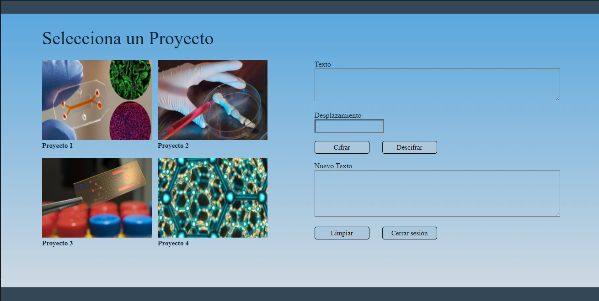

# Cifrado César

## Índice

* [Preámbulo](#preámbulo)
* [Resumen del proyecto](#resumen-del-proyecto)
* [Propuesta](#propuesta)
* [Desarrollo](#desarrollo)
* [Flujo de desarrollo del proyecto](#flujo-de-desarrollo-del-proyecto)
* [Instrucciones](#instrucciones)
* [Checklist](#checklist)

***

## Preámbulo

El [cifrado César](https://en.wikipedia.org/wiki/Caesar_cipher) es una de las técnicas más simples para cifrar un mensaje. Es un tipo de cifrado por sustitución, es decir que cada letra del texto original es reemplazada por otra que se encuentra un número fijo de posiciones (desplazamiento) más adelante en el mismo alfabeto.

Por ejemplo, si usamos un desplazamiento (_offset_) de 3 posiciones:

* La letra A se cifra como D.
* La palabra CASA se cifra como FDVD.
* Alfabeto sin cifrar: A B C D E F G H I J K L M N O P Q R S T U V W X Y Z
* Alfabeto cifrado: D E F G H I J K L M N O P Q R S T U V W X Y Z A B C

## Resumen del proyecto

En este proyecto se creó una aplicación web que permite al usuario
pueda cifrar y descifrar un texto indicando un desplazamiento específico de
caracteres.
 
La temática de este proyecto es una web de uso interno para un centro de investigación, este programa permite a los científicos de la institución compartir de manera segura los proyectos en proceso con otros equipos, hasta que sus avances y datos estén listos para ser publicados.

## Propuesta

## Primera Propuesta
* En la idea inicial se planteó que los usuarios sean profesores que dictan clases online, la aplicación web les permitirá encriptar expedientes de alumnos a los que enseñaron previamente y tener acceso a la historia de los alumnos a los que les tocará enseñar.
### Boceto
* Inicialmente se realizó un prototipo a mano, planteando dos páginas: una de inicio de sesión y otra donde se realiza el descifrado/cifrado.
* Boceto a mano

* Boceto en [Figma](https://www.figma.com/file/6tJYVg6wbCUEgQ0mnadUFH/Prototipo-cipher-1?node-id=0%3A1)

### Feedback
* En base al feedback obtenido de profesores universitarios y profesores de centros de idiomas, se cambió la propuesta debido a que esta tenía muchas similaridades a los sistemas intranet que ellos usan y no parecía ser un tema muy interesante.
 
 
## Segunda Propuesta
* Para la segunda propuesta se plantea proteger la información de un centro de investigación donde científicos se encuentran trabajando en proyectos en simultáneo, esta app web permite que dentro del centro se pueda compartir la información de manera más segura, manteniendo un registro de quien accede a esta.
* Este proyecto puede ayudar en la protección de datos de investigación, en especial durante la revisión de pares, puede prevenir el robo del manuscrito, la manipulación de contenidos y el robo de autoría.
### Boceto
* Para este prototipo se mantuvieron las páginas, pero se modificó el layout de la página 2 para que sea más amigable con el usuario (menos cajas de texto, menos alerts y más botones).
* Prototipo en [Figma](https://www.figma.com/file/lGrRPxW8fWKQTZM4QYeD5z/Prototipo-cipher-2?node-id=0%3A1)

## Desarrollo
Teniendo el primer boceto en Figma finalizado, se realizó la estructura de la primera página en HTML con un formulario, un diseño básico en CSS y el addEventListener JavaScript que permitiera acceder a la siguiente página; después de estudiar más de HTML semántico, CSS selectors y box type, se lograron corregir problemas en dimensiones, centrar y fijar elementos.
Para la página 2, se realizó la estructura básica en HTML y CSS, en JavaScript se hicieron los addEventListener para la limpieza de formularios y se editaron algunas cosas en base al DOM JS.
Una vez la estructura básica de la página web fue completada, se procedió a trabajar en la función encode y decode para letras mayúsculas. Al probar estas funciones, la encode solo encriptaba correctamente la primera letra de las palabras, gracias a la colaboración con otras compañeras se logró resolver este problema al colocarle un parseInt al offset. Se corrieron las pruebas unitarias por primera vez.
Además, se editó el diseño de la página 2:
- Se agregaron las imágenes y textos de los proyectos.
- Se redujo la cantidad de text inputs a una caja que recibe el string, una que recibe el offset y un textarea donde aparecerá el resultado.
- Se agregaron los botones 'limpiar' y 'Elige otro proyecto'.

Luego se editaron las funciones para que acepten letras minúsculas, con este caso hubo un problema al definir la función decode, pero nuevamente se logró resolver al colaborar con compañeras que se encontraban realizando el mismo proyecto. Se procedió a hacer que las funciones aceptaran otros tipos de caracteres.
Para las pruebas unitarias, el tercer TypeError pudo ser corregido al hacer una condición que verifica que el valor de la variable 'string' es un String.
Un día antes de que cierre el segundo sprint se recibio feedback de compañeras, lo cual fue muy útil para editar el diseño en CSS y decidir entregar el proyecto.

## Flujo de desarrollo del proyecto

* Investigar Cifrado César
* Plantear el tipo de usuario, de servicio y cómo el programa afecta en el usuario.
* Boceto a mano y en Figma.
* Creación de la estructura de la página 1: HTML, JS y CSS.
* Creación de la estructura de la página 2: HTML, JS y CSS.
* Empezar funcion encode.
* Cambio de usuario y tematica.
* Cambio de diseno: Nuevo boceto en Figma.
* Edicion de la pag 2 en base al nuevo diseño.
* Completar las funciones encode y decode.
* Correr tests y corregir los TypeError.
* Detalles finales en CSS.
* Completar el ReadMe.
* AutoEvaluacion.
* Peer review.
* Detalles finales.
* Entrega final.

## Instrucciones

1. Inicia Sesión en el sistema. Para ingresar a la plataforma el usuario debera ingresar con las siguientes credenciales: el user es usuario1 y la contraseña es contrasena1, el numero al final puede ser reeplazado por 0,2,3 o 4.
2. Selecciona un proyecto, la información de algunos estara enciptada y de otros no.
3. Ingresa el mensaje en el cuadro de texto. Este, permite ingresar mayúsculas, minúsculas, carácteres especiales, de puntuación y los espacios estan permitidos. 
4. Ingresa el número de caracteres que deseas desplazar el texto.
5. Elige una opción dependiendo de si quieres cifrar o descifrar un mensaje. 
6. El resultado cifrado/descifrado aparecera en el cuadro de texto.
7. Para borrar el texto, el desplazamiento y el texto cifrado/descifrado da click en el botón 'Limpiar'.
8. Para ver otro proyecto selecciona el botón 'Elige otro proyecto'.
9. Para salir da click en el botón 'Cerrar sesión'.

## Vista de la página web

## Checklist

### Parte Obligatoria

* [x] `README.md` incluye info sobre proceso y decisiones de diseño.
* [x] `README.md` explica claramente quiénes son los usuarios y su relación con
  el producto.
* [x] `README.md` explica claramente cómo el producto soluciona los
  problemas/necesidades de los usuarios.
* [x] Usa VanillaJS.
* [x] Implementa `cipher.encode`.
* [x] Implementa `cipher.decode`.
* [x] Pasa linter con configuración provista.
* [x] Pasa pruebas unitarias.
* [x] Pruebas unitarias cubren 70% de _statements_, _functions_ y _lines_, y un
  mínimo del 50% de _branches_.
* [x] Interfaz permite elegir el `offset` o _desplazamiento_ a usar en el
  cifrado/descifrado.
* [x] Interfaz permite escribir un texto para ser cifrado.
* [x] Interfaz muestra el resultado del cifrado correctamente.
* [x] Interfaz permite escribir un texto para ser descifrado.
* [x] Interfaz muestra el resultado del descifrado correctamente.

### Parte Opcional: "Hacker edition"

* [x] Cifra/descifra minúsculas
* [x] Cifra/descifra _otros_ caracteres (espacios, puntuación, `ñ`, `á`, ...)
* [ ] Permite usar un `offset` negativo.
