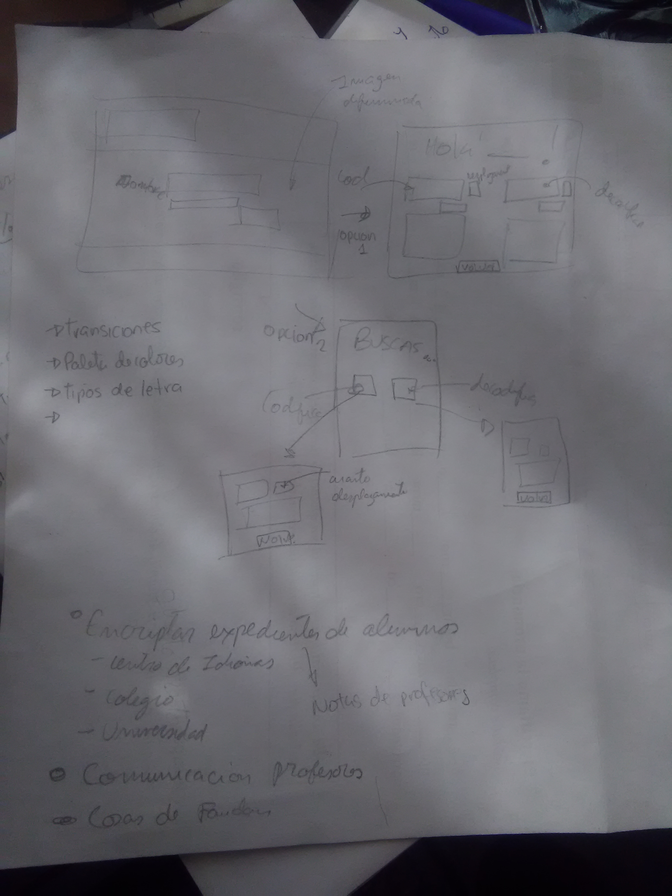
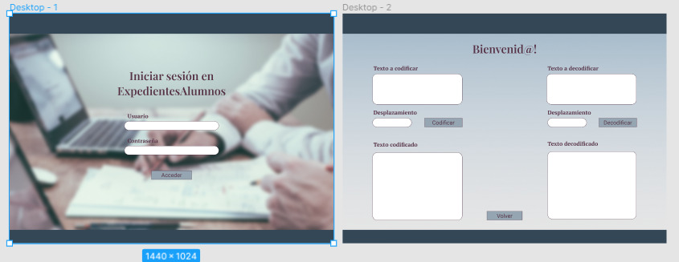
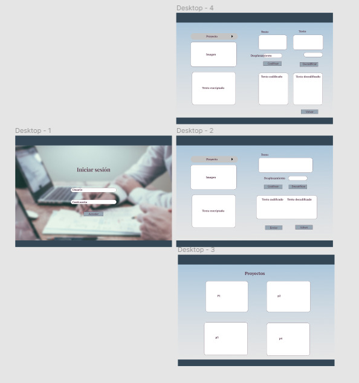
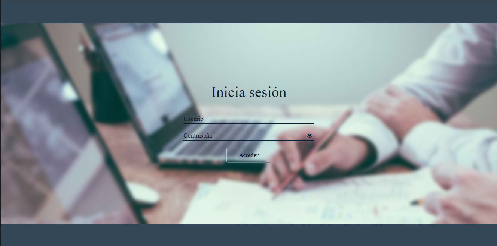
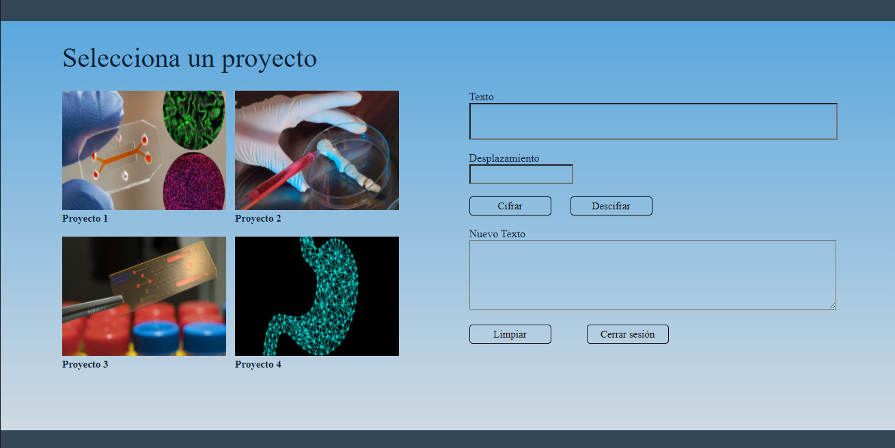

# Cifrado César

## Índice

* [Preámbulo](#preámbulo)
* [Resumen del proyecto](#resumen-del-proyecto)
* [Propuesta](#propuesta)
* [Desarrollo](#desarrollo)
* [Flujo de desarrollo del proyecto](#flujo-de-desarrollo-del-proyecto)
* [Instrucciones](#instrucciones)
* [Checklist](#checklist)

***

## Preámbulo

El [cifrado César](https://en.wikipedia.org/wiki/Caesar_cipher) es una de las técnicas más simples para cifrar un mensaje. Es un tipo de cifrado por sustitución, es decir que cada letra del texto original es reemplazada por otra que se encuentra un número fijo de posiciones (desplazamiento) más adelante en el mismo alfabeto.

Por ejemplo, si usamos un desplazamiento (_offset_) de 3 posiciones:

* La letra A se cifra como D.
* La palabra CASA se cifra como FDVD.
* Alfabeto sin cifrar: A B C D E F G H I J K L M N O P Q R S T U V W X Y Z
* Alfabeto cifrado: D E F G H I J K L M N O P Q R S T U V W X Y Z A B C

## Resumen del proyecto

En este proyecto se creo una aplicación web que permite al usuario
pueda cifrar y descifrar un texto indicando un desplazamiento específico de
caracteres.

La temática de este proyecto es una web de uso interno para un centro de investigacion, este programa permite a los cientificos de la institucion compartir de manera segura los proyectos en proceso con otros equipos, hasta que sus avances y datos esten listos para ser publicados.

## Propuesta

## Primera Propuesta
* En la idea inicial se planteo que los usuarios sean profesores que dictan clases online, la aplicacion les permitiria encriptar expedientes de alumnos a los que ensenaron previamente y tener acceso a la historia de los alumnos a los que les tocara enseñar.
### Boceto
* Inicialmente se realizo un prototipo a mano, planteando dos paginas: una de inicio de sesion y otra que donde se realiza el descifrado/cifrado.
* Boceto a mano

* Boceto en [Figma](https://www.figma.com/file/6tJYVg6wbCUEgQ0mnadUFH/Prototipo-cipher-1?node-id=0%3A1)

### Feedback
* En base al feedback obtenido de profesores universitarios y profesores de centros de idiomas, se cambio la propuesta debido a que esta tenia muchas similaridades a los sistemas intranets que ellos usan y no parecia se un tema muy interante.

## Segunda Propuesta
* Para la segunda propuesta se plantea proteger la informacion de un centro de investigacion donde cientificos se encuentran trabajando en proyectos en simultaneo, esta app web permite que dentro del centro se pueda compartir la informacion de manera mas segura, manteniendo un registro de quien accede a esta.
* Este proyecto puede ayudar en la proteccion de datos de investigacion, en especial durante la revisión de pares, puede prevenir el robo del manuscrito, la manipulación de contenidos y robo de autoría.
### Boceto
* Para este prototipo se mantuvieron las paginas, pero se modifico el layout de la pagina 2 para que sea mas amigable con el usuario (menos cajas de texto, menos alerts y mas botones).
* Prototipo en [Figma](https://www.figma.com/file/lGrRPxW8fWKQTZM4QYeD5z/Prototipo-cipher-2?node-id=0%3A1)

## Desarrollo
Teniendo el primer boceto en Figma finalizado, se realizo la estructura de la primera pagina en HTML con un formulario, un diseno basico en CSS y el addEventListener JavaScript que permitiera acceder a la siguiente pagina; despues de estudiar mas de HTML semantico, CSS selectors y box type, se lograron corregir problemas en dimensiones, centrary fijar elementos.
Para la pagina 2, se realizo la estructura basica en HTML y CSS, en JavaScript se hicieron los addEventListener para la limpieza de formularios y se editaron algunas cosas en base al DOM JS.
Una vez la estructura basica de la pagina web fue completada, se procedio a trabajar en la funcion encode y decode para letras mayusculas. Al probar estas funciones, la encode solo encriptaba correctamente la primera letra de las palabras, gracias a la colaboracion con otras compañeras se logro resolver este problema al colocarle un parseInt al offset. Se corrieron las pruebas unitarias por primera vez.
Ademas, se edito el diseño de la pagina 2: 
- Se agregaron las imagenes y textos de los proyectos.
- Se redujo la cantidad de text inputs a una caja que recibe el string, una que recibe el offset y un text area donde aparecera el resultado.
- Se agregaron los botones 'limpiar' y 'Elige otro proyecto'.

Luego se editaron las funciones para que acepten letras minusculas, con este caso hubo un problema al definir la funcion decode, pero nuevamente se logro resolver al colaborar con compañeras que se encontraban realizando el mismo proyecto. Se procedio a hacer que las funciones acepten otros tipos de caracteres.
Para las pruebas unitarias, el tercer TypeError pudo ser corregido al hacer una condicion que verificara que el valor de la variable 'string' es un String.
Un dia antes de que cierre el segundo sprint se recibio feedback de companeras, lo cual fue muy util para editar el diseno en CSS y decidir entregar el proyecto.

## Flujo de desarrollo del proyecto

* Investigar Cifrado César
* Plantear el tipo de usuario, de servicio y cómo el programa afecta en el usuario.
* Boceto a mano y en Figma.
* Creación de la estructura de la pag 1: HTML, JS y CSS.
* Creación de la estructura de la pag 2: HTML, JS y CSS.
* Empezar funcion encode.
* Cambio de usuario y tematica.
* Cambio de diseno: Nuevo boceto en Figma.
* Edicion de la pag 2 en base al nuevo diseno.
* Realizacion de las funciones encode y decode.
* Correr tests y corregir los TypeError.
* Detalles finales en CSS.
* Completar el ReadMe.
* AutoEvaluacion.
* Someter el proyecto a peer review.
* Detalles finales.
* Entrega final.

## Instrucciones

1. Inicia Sesion en el sistema. Donde user=usuario[i], contraseña=contrasena[i], i=0:4.
2. Selecciona un proyecto, la informacion de algunos estara enciptada y de otros no.
3. Ingresa el mensaje en el cuadro de texto. Este, permite ingresar mayusculas, minusculas, caracteres especiales, de puntuación y los espacios estan permitidos. 
4. Ingresa el número de caracteres que deseas desplazar el texto.
5. Elige una opción dependiendo de si quieres cifrar o descifrar un mensaje. 
6. El resultado cifrado/descifrado aparecera en el cuadrodo de texto.
7. Para borrar el texto, el desplazamiento y el texto cifrado/descifrado da click en el boton 'Limpiar'.
8. Para ver otro proyecto selecciona el boton 'Elige otro proyecto'.
9. Para salir da click en el boton 'Cerrar sesion'.

## Vista de la pagina web

## Checklist

### Parte Obligatoria

* [x] `README.md` incluye info sobre proceso y decisiones de diseño.
* [x] `README.md` explica claramente quiénes son los usuarios y su relación con
  el producto.
* [x] `README.md` explica claramente cómo el producto soluciona los
  problemas/necesidades de los usuarios.
* [x] Usa VanillaJS.
* [x] Implementa `cipher.encode`.
* [x] Implementa `cipher.decode`.
* [x] Pasa linter con configuración provista.
* [x] Pasa pruebas unitarias.
* [x] Pruebas unitarias cubren 70% de _statements_, _functions_ y _lines_, y un
  mínimo del 50% de _branches_.
* [x] Interfaz permite elegir el `offset` o _desplazamiento_ a usar en el
  cifrado/descifrado.
* [x] Interfaz permite escribir un texto para ser cifrado.
* [x] Interfaz muestra el resultado del cifrado correctamente.
* [x] Interfaz permite escribir un texto para ser descifrado.
* [x] Interfaz muestra el resultado del descifrado correctamente.

### Parte Opcional: "Hacker edition"

* [x] Cifra/descifra minúsculas
* [x] Cifra/descifra _otros_ caracteres (espacios, puntuación, `ñ`, `á`, ...)
* [ ] Permite usar un `offset` negativo.
